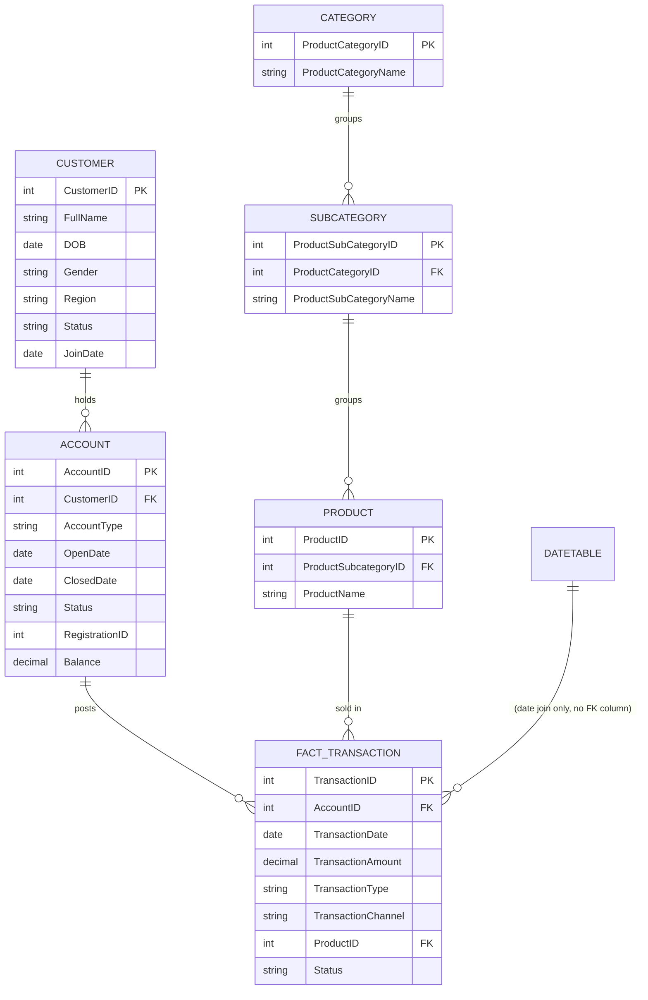

# Data Dictionary

Six tables, ~10,500 rows total (plus a redundant duplicate — see notes). Grain and relationships below reflect what's actually in the files, not an idealized schema.

## customer.csv → `customer` (100 rows)
| Column | Type | Notes |
|---|---|---|
| CustomerID | INT (PK) | |
| FullName | VARCHAR | |
| DOB | DATE | Stored `dd/mm/yyyy` — needs explicit format parsing, not a default cast. |
| Gender | VARCHAR | Male / Female |
| Region | VARCHAR | 8 values: Massachusetts, Kansas, Colorado, Utah, California, Alaska, Florida, New Mexico |
| Email | VARCHAR | |
| Status | VARCHAR | Active (33) / Suspended (38) / Inactive (29) |
| JoinDate | DATE | Stored `dd/mm/yyyy`, same parsing caveat as DOB. |

**A second file, `DimCustomerUSA.csv`, is a byte-for-byte duplicate of this table.** It is not a USA-specific subset — loading both into the same model will double-count customers. Drop one before modeling.

## account.csv → `account` (194 rows)
| Column | Type | Notes |
|---|---|---|
| AccountID | INT (PK) | |
| CustomerID | INT (FK → customer) | One customer can hold multiple accounts. |
| AccountType | VARCHAR | Checking (70) / Savings (66) / Credit (57) |
| OpenDate | DATE | Stored `yyyy-mm-dd`. |
| ClosedDate | DATE | Null for the 86 Open accounts, populated for the 107 Closed — no orphaned nulls. |
| Status | VARCHAR | Open (86) / Closed (107) |
| RegistrationID | INT | **Values 1–3, no lookup table provided anywhere in the source files.** Meaning (registration channel? type code?) is undocumented — confirm with the schema owner before using it in analysis. |
| Balance | DECIMAL(10,2) | Point-in-time snapshot, not a time series — there's no balance-history table, so this can only support a current-state view, not balance-over-time trending. Can be negative (e.g., a Credit account showing money owed). |

## fact_transaction.csv → `fact_transaction` (10,000 rows)
| Column | Type | Notes |
|---|---|---|
| TransactionID | INT (PK) | Transaction-level grain. |
| AccountID | INT (FK → account) | |
| TransactionDate | DATE | Stored `mm/dd/yyyy` — a third distinct date format alongside customer and account tables. Range: 2020-01-01 to 2025-12-31. |
| TransactionAmount | DECIMAL(10,2) | **Signed** — positive and negative values both occur. Every query in this project wraps it in `ABS()`; summing it raw understates volume and lets Debit/Credit partially cancel out. |
| TransactionType | VARCHAR | Debit (6,037) / Credit (3,963) |
| TransactionChannel | VARCHAR | Mobile (5,044) / Web (2,990) / ATM (1,966) |
| ProductID | INT (FK → product) | |
| Status | VARCHAR | Success (9,533) / Failed (467) |

No missing values in any column of this table.

## product.csv → `product` (27 rows)
| Column | Type | Notes |
|---|---|---|
| ProductID | INT (PK) | IDs 1000–1026. |
| ProductSubcategoryID | INT (FK → subcategory) | |
| ProductName | VARCHAR | 3-letter product code (e.g., AAA, BCC) — not a descriptive name. |

## subcategory.csv → `subcategory` (9 rows)
| Column | Type | Notes |
|---|---|---|
| ProductSubCategoryID | INT (PK) | |
| ProductCategoryID | INT (FK → category) | 3 subcategories per category. |
| ProductSubCategoryName | VARCHAR | 2-letter code (e.g., AA, BC). |

## category.csv → `category` (3 rows)
| Column | Type | Notes |
|---|---|---|
| ProductCategoryID | INT (PK) | |
| ProductCategoryName | VARCHAR | A / B / C — coded labels, not descriptive category names. Total transaction value is close to even across all three ($8.16M–$8.70M), so no category currently dominates. |

## DateTable (Power BI model only — not a source CSV)
| Column | Type | Notes |
|---|---|---|
| Date | DATE (PK) | Joined to `fact_transaction.TransactionDate`. |
| Month | VARCHAR | Month name. |
| Month Number | INT | 1–12. |
| Month Year | VARCHAR | e.g., "Jan 2023". |
| Year | INT | |

Standard calendar dimension — generated for the model, not present as its own CSV export.

## Not Currently in Scope

The uploaded files reference a `Data_Model.png` schema diagram and a `Banking_Intelligence.pbix` file. The PNG was never actually present among the uploads (only an inline chat screenshot), so the entity-relationship diagram below is text/mermaid, not the original visual — re-upload the PNG if you want it embedded instead.

## Entity Relationships

