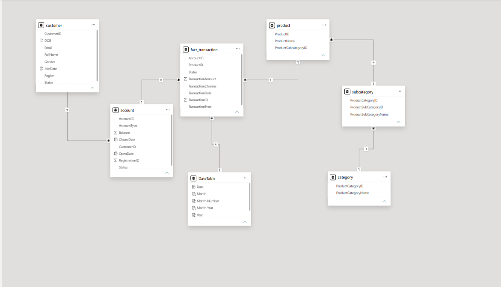

# Banking Transaction & Customer Analytics

SQL, Python, and Power BI analytics on 10,000 banking transactions across 100 customers — built to replace gut-feel decisions about channel, product, and customer retention with evidence.

## The Business Problem

Customer, account, transaction, and product data existed as disconnected flat extracts with no analytical layer on top. Full problem framing, objectives, and workstreams are in [`05_Documentation/Business_Problem.md`](05_Documentation/Business_Problem.md).

## What's in this repo

```
├── 01_Dataset/                          (source CSV extracts + data dictionary)
│   ├── DimAccount.csv                   (194 accounts — type, status, balance)
│   ├── DimCustomer.csv                  (100 customers — region, status, join date)
│   ├── DimCustomerUSA.csv               (duplicate of DimCustomer.csv — not a separate cohort)
│   ├── DimProduct.csv                   (27 products)
│   ├── DimProductCategory.csv           (3 categories: A / B / C)
│   ├── DimProductSubCategory.csv        (9 subcategories)
│   ├── FactTransaction.csv              (10,000 transactions, Jan 2020 – Dec 2025)
│   └── data_directory.md                (column-level data dictionary + ERD)
├── 02_SQL/
│   └── Business_Solution.sql            (18 business-question queries)
├── 03_Python/
│   ├── Exploratory_Data_Analysis.ipynb  (type checks, nulls, duplicates, referential integrity)
│   └── Statistical_Analysis.ipynb       (descriptive stats, correlation, hypothesis tests)
├── 04_PowerBI/
│   ├── Banking_Intelligence.pbix        (3-page dashboard suite)
│   ├── Customer & Account Analytics.png
│   ├── Data_Model.png                   (schema / ERD)
│   ├── Executive Banking Overview.png
│   └── Transaction & Product Analysis.png
├── 05_Documentation/
│   ├── Business_Conclusion_Report.pdf   (full findings + methodology)
│   ├── Business_Problem.md
│   ├── KPI_definitions.md
│                                  
└── LICENSE
```

## Data Model



`customer` → `account` → `fact_transaction` is the core chain; `product` → `subcategory` → `category` rolls up product performance. Full column-level detail and relationship notes are in [`data_directory.md`](01_Dataset/data_directory.md).

## Dashboards

**Executive Overview** — top-line KPIs, monthly trend, channel/type/region value, customer status.


**Customer & Account Analysis** — customer count, active rate, region and status breakdowns.


**Transaction & Product Analysis** — product category performance, success rate, channel and type mix.


## Key Findings

- **$25.08M** total transaction value across **10,000** transactions, at a **95.3%** success rate.
- **67% of customers are Suspended or Inactive** (38% / 29%) — only 33% Active. This is the central risk in the dataset.
- Transaction frequency correlates almost perfectly with customer value (**r = 0.99**); customer age does not (**r ≈ 0.06–0.07**).
- Three hypothesis tests (Debit vs. Credit value, channel value, customer status vs. channel) all came back statistically insignificant (p > 0.05) — none of the obvious explanations account for the Suspended/Inactive gap.
- **ATM has the highest failure rate** of the three channels (5.34% vs. 3.95% on Web).

Full methodology, statistical detail, and recommendations: [`Business_Conclusion_Report.pdf`](05_Documentation/Business_Conclusion_Report.pdf).

## Tech Stack

SQL Server · Python (pandas, scipy) · Power BI
